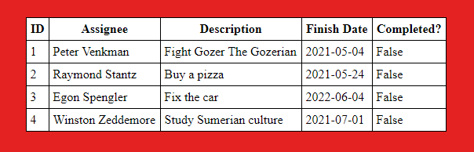

# GhostBusters To Do Table!

## Intro
With paranormal ghost cases on the increase, our justice fighters must receive a helpful tool to deal with all those assignments. Our 'GhostBusters to do table' lives to ease the lives of the ghostbusters, and make their assignment easier to track, update, delete and add.

## Installation

1) The app requires Node.js ^14.15.4
```sh
    download link of the latest version of node.js can be found here:
        
        https://nodejs.org/en/download/
```

2) The app requires npm ^6.14.10
```sh
    npm install -g npm
```
3) Enter the library containing the project using visual studio code, terminal ...

4) install the project dependencies:

```sh
    npm install --save
```

      Make sure that the following packages were installed:

```sh
    * body-parser": "^1.19.0
    * ejs": "^3.1.6
    * express": "^4.17.1
    * mysql": "^2.18.1
    * nodemon": "^2.0.7
    * path": "^0.12.7
```
5) open server.js file, and set the correct local mySql connection settings 
   (user, password). 

   <ins>db:</ins> ghostbusters

   <ins>example:</ins>

   

5) Install mySql server:
```sh
    download link of the latest version of mySql server can be found here:

        https://dev.mysql.com/downloads/installer/    
```

6) create local db (ghostbusters) in mySql server:
```sh
    open and run 'GhostBusters - create_db.sql' in mySql server 
```

## Init

1) Make sure to use port:3000

2) Run nodemon server.js in terminal.

3) Open this url in chrome browser:
    http://localhost:3000/

4) If everything is fine, you should see this page:

    


## Possible authentication error
**if you receive the following error:**

    Error: ER_ACCESS_DENIED_ERROR: Access denied for user '[user]' (using password: YES)

**Follow those steps:**
1) Enter your MYSQL.
2) open new script.
3) run the following 2 commands: 
```sh
    ALTER USER '[user]' IDENTIFIED BY '[password]'; 

    flush privileges;
```

## Usage

**In the browser enter the todo page. You should see the following:**


**The page contain two main parts:**

1) The to do table is built from 5 columns:
    
    1.1) <ins>ID:</ins> assignment id 
    
    1.2) <ins>Assignee:</ins> one of the following : Peter Venkman, Raymond Stantz, Dana Barrett, Egon Spengler, Louis Tully, Janine Melnitz, Walter Peck, Winston Zeddemore.

    <ins>note:</ins> if you want to add additional assignee, please contact us through the conntact form on the main page.

    1.3) <ins>Description:</ins> an assignment description (maximum 500 characters).

    1.4) <ins>Finish Date:</ins> finish date of the assignment in this format: YYYY-MM-DD.

    1.5) <ins>Completed:</ins> contains two possible values (true/false), depends if the assignment completed or not.

    <ins>The to do table:</ins>

    

2) Four Forms buttons: Add, Delete, Update, Complete.  while pressing on one of those buttons a new form window is opened.

    2.1) <ins>Add:</ins>

        2.1.1) Required values: Assignee, Finish Date (Description may be updated afterwards)
        
        2.1.2) After pressing the submit button, a new row (if all values are valid) is created in to do table with a unique id.
        
        2.1.3) Press 'close' button to close the form.
    
    
    

    2.2) <ins>Delete:</ins>
        
        2.2.1) Required values: ID.
        
        2.2.2) After pressing the submit button, (if the ID is valid) a row with the specified id will be removed from the to do table.
        
        2.2.3) Press 'close' button to close the form.

        

    2.3) <ins>Update:</ins>
        
        2.3.1) Required values: ID.

        2.3.2) After pressing the submit button, (if the ID is valid) a row with the specified id will be updated in the to do table (only if at least one additional value was specified by user (Assignee/Description/Finish Date)). 

        2.3.3) Press 'close' button to close the form.
     


    2.4) <ins>Complete:</ins>

        2.4.1) Required values: ID
        
        2.4.2) After pressing the submit button, (if the ID is valid) the status of a row with the specified id will be set to 'True' (assignment completed).
        
        2.2.3) Press 'close' button to close the form.
         

## Authors:
🐧 Michael Korsunsky, Matan Levi